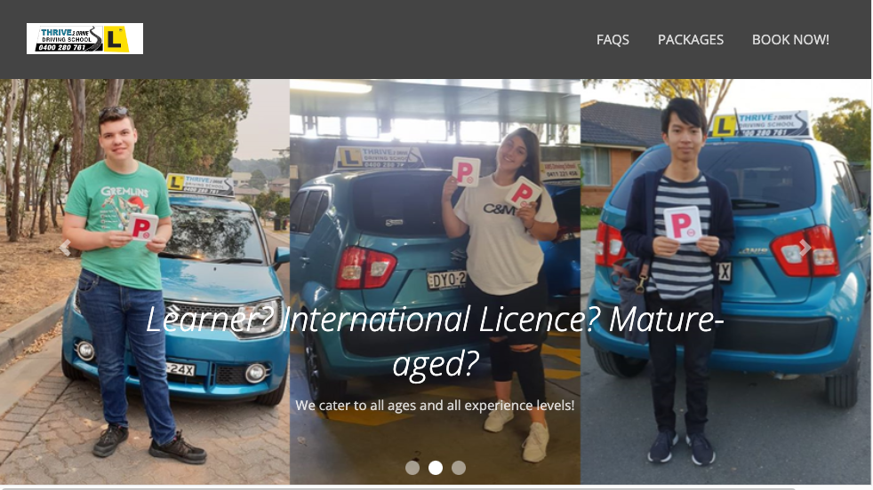

# Thrive2Drive Driving School website (2018)
## Overview

This is the OG. A website I designed in 2018 that is [still live to this day!](https://www.thrive2drive.com.au)

It is a website for my Mum's driving school. She needed a site around the same time I was doing a web design specialization on Coursera, so I had a crack. It's not pretty, but it still works and Mum still takes bookings from it.

- The html is a homepage, FAQs page and pricing page that lead to a contact form. Form data sent to business email address using PHP.

- It is styled using CSS Bootstrap with some template carousels, a navbar etc.

- There is a tiny bit of javascript for the animation on the homepage.

Definitely not going to win any awards, but it was my first exposure to coding, and I like having it on here as a reference point/nostalgia piece. And if you need an experienced driving instructor in the Greater Western Sydney region, enquire within!

